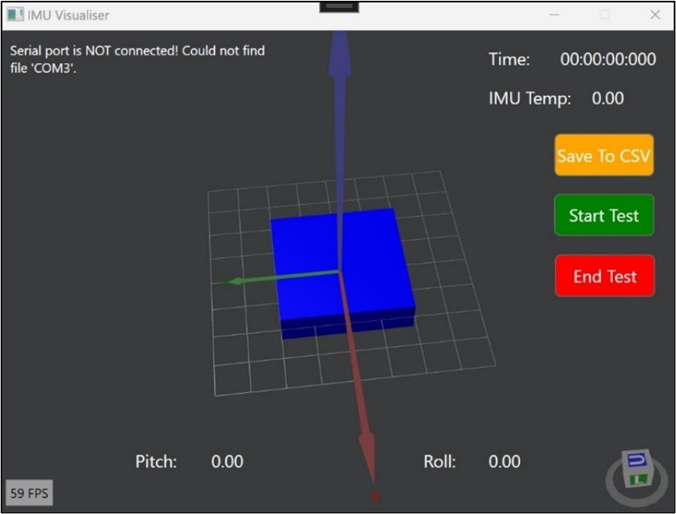

# PoseMate IMU Visualiser

    
   

This application was designed to gather data from the PoseMate device and allow for data collection and analysis.

The code for this system is divided into three main files:
1. MainWindow.xaml - Here you will find the main markup file for all visual elements of the program.
2. MainViewModel.cs - This file creates the 3D object for the IMU animation using WPF Helix Toolkit.
3. MainWindow.xaml.cs - This file contains functions for UI elements such as buttons. Serial communication and CSV data collection