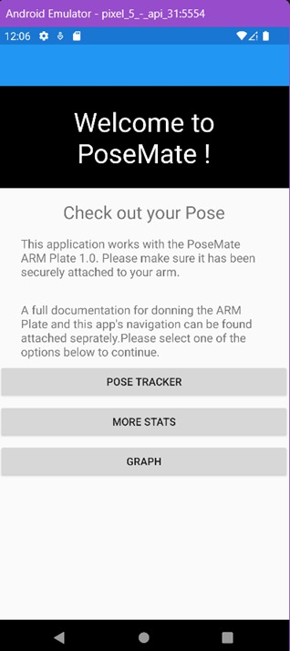
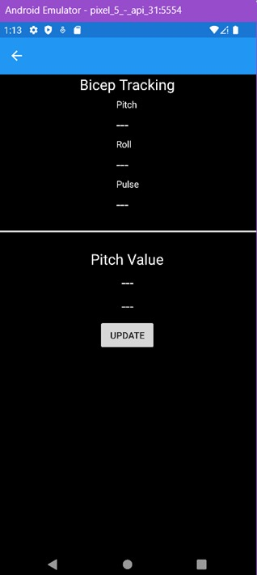

# PoseMate Mobile App Prototype

    
   
    
   

This app was made by Aaron Rodrigo.

## Serial Bluetooth Terminal - GUI placeholder
The below terminal was used as a placeholder for the app. With a setup similar to the IMU Visualiser it should be possible to convert PoseMate's output stream into individual elements that can be updated on the PoseMate app.
 

    

