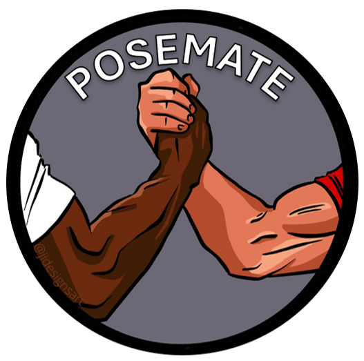

<a name="readme-top"></a>

<!-- PROJECT SHIELDS -->
<!--
*** Project Shields will go here once the project is publically available.
-->

<!-- PROJECT LOGO -->
<div align="center">
    
  <br />
  
  <p align="center">
    Bodybuilding Monitoring and Dynamic Feedback Device
    <br />
    <a href="https://github.com/LeonidasEng/PoseMate/issues">Report Bug</a>
    ·
    <a href="https://github.com/LeonidasEng/PoseMate/issues">Request Feature</a>
  </p>
</div>


<!-- TABLE OF CONTENTS -->
<details>
  <summary>Table of Contents</summary>
  <ol>
    <li><a href="#about-posemate">About PoseMate</a> 
      <ul>
        <li><a href="#built-with">Built With</a>
      </ul>
    </li>
    <li><a href="#roadmap">Roadmap</a></li>
    	  <ul>
        <li><a href="#sprint-1-research">Sprint 1 Research</a></li>
        <li><a href="#sprint-2-sensor-implementation">Sprint 2 Sensor Implementation</a></li>
        <li><a href="#sprint-3-MVP-manufacturing">Sprint 3 MVP Manufacturing</a></li>
        <li><a href="#sprint-4-integration">Sprint 4 Integration</a></li>
      </ul>
	  </li>
    <li><a href="#changelog">Changelog</a></li>
    <li><a href="#contributing-internal">Contributing - Internal</a></li>
    <li><a href="#contributing-external">Contributing - External</a></li>
    <li><a href="#license">License</a></li>
    <li><a href="#contact">Contact</a></li>
    <li><a href="#acknowledgments">Acknowledgments</a></li>
  </ol>
</details>


<!-- ABOUT THE PROJECT -->


<!-- About Project -->
## About PoseMate
<details>
<summary>Click to expand/collapse</summary>
<h3 align="center">
  
  </h3>
Introducing PoseMate, the revolutionary wearable fitness device made for bodybuilders. Preparing for a competition often means aiming for the perfect muscle pump and relying heavily on your coach's best guesses to peak at the right moment.
But what if guessing wasn't part of the process? PoseMate changes the game.
<br />
<br />
Developed by a group of second-year Robotics and Electronic Engineering students, PoseMate stands out in a crowded market. Unlike other fitness trackers, it goes beyond just collecting your workout data.
<br />
<br />
It provides you with real-time feedback as you exercise or pose, helping you understand exactly what works for your body. PoseMate is about making sure you hit your peak with confidence, offering insights that guide you to your best look. 
<br />
Say goodbye to uncertainty and hello to your best physique with PoseMate.

### PoseMate's functionality includes:
 *  Audible feedback to improve bicep engagement, bicep curl form and double bicep pose form. 
 *  Measure arm circumference 
 *  Modes for different exercises


 (Currently, PoseMate is designed exclusively for bicep curls and poses, but future versions could include enhancements to support a broader range of exercises.)


### Built With
* C#/C++
* ARM
* Mbed Studio
* MPU6050
* RS Pro 10k Potentiometer
* SEN-11574
* WPF Helix Toolkit - IMU Visualiser
* Xamarin - PoseMate App

### Custom Applications - With READMEs
<a href="https://github.com/LeonidasEng/PoseMate/tree/main/IMU-Visualiser/SimpleDemo">View IMU Visualiser - Development Tool</a>
<a href="https://github.com/LeonidasEng/PoseMate/tree/main/PoseMate_App/PoseMate_App">View PoseMate App - Commercial Prototype</a>


</details>


<p align="right">(<a href="#readme-top">back to top</a>)</p>

<!-- ROADMAP AND CHANGELOG -->
## PoseMate - Roadmap
<details>
<summary>Click to expand/collapse</summary>

### Sprint 1 Research
- [x] Sprint 1 Hypothesis
- [x] Sensor Research
- [x] Competitor Analysis
- [x] Card MVP
- [x] Gym Risk Assessment
- [x] Testing Framework
- [x] Pivot or Persevere?

### Sprint 2 Sensor Implementation
- [x] Sprint 2 Hypothesis
- [x] Pulse Sensor
- [x] Potentiometer
- [x] Inertial Measurement Unit
- [x] Sensor Housing
- [x] Sleeve Design
- [x] Pivot or Persevere

### Sprint 3 MVP Manufacturing
- [x] Sprint 3 Hypothesis
- [x] Wristwatch development
- [x] Sleeve Design Development
- [x] Custom Wiring
- [x] Microcontroller Housing

### Sprint 4 Integration
- [x] Sprint 4 Hypothesis
- [x] GUI Design
- [x] Code Encapsulation
- [x] Final Changes
- [x] Testing
- [x] Presentation

</details>
<p align="right">(<a href="#readme-top">back to top</a>)</p>

## Assignment Outcome
[TBC]

## Changelog
You can find the changelog for this repo here: [Changelog](https://github.com/LeonidasEng/Exoskeleton/blob/main/CHANGELOG.md)

See the [open issues](https://github.com/LeonidasEng/Exoskeleton/issues) for a full list of proposed features (and known issues).

<p align="right">(<a href="#readme-top">back to top</a>)</p>

<!-- CONTRIBUTING -->
## Contributing - Internal
### Accept the Invite
1. To be granted access to this repo, you will receive an invitation link via your UCLAN email address.
2. You need to click on the link provided in the notification to accept the invitation.
3. If you don't have a GitHub account, you will be prompted to create one before accepting the invitation.

### Clone the Repo
1. Once you have accepted the invitation, you need to clone the repository to your local machine.
2. On the repository page, click on the green "Code" button.
3. Copy the HTTPS or SSH URL of the repository (you can toggle between the two options).
4. Open a terminal or command prompt on your local machine.
5. Navigate to the directory where you want to clone the repository.
6. Run the following command for HTTPS:
    ```sh
    git clone https://github.com/LeonidasEng/Exoskeleton.git
    ```
### Accessing the Repo
1. After cloning the repository, you can access its contents on your local machine.
2. You can make changes, add files, or create branches within the repository based on the permissions granted to you.

### Push changes
1. Once you've made changes to the repository, you can push those changes back to GitHub.
2. In the terminal or command prompt, navigate to the repo's directory.
3. Run the following commands to stage, commit, and push the changes:
    ```sh
    git add .
    git commit -m "Enter a descriptive commit message"
    git push
    ```
That's it now you can collaborate on the project with the rest of the team!

## Contributing - External
This project was done as part of a 2nd year Engineering Assignment. Any feedback you can give is **greatly appreciated**.

If you have a suggestion that would make this better, please fork the repo and create a pull request. You can also simply open an issue with the tag "enhancement".

1. Fork the Project
2. Create your Feature Branch (`git checkout -b feature/NewFeature`)
3. Commit your Changes (`git commit -m 'Add some NewFeature'`)
4. Push to the Branch (`git push origin feature/NewFeature`)
5. Open a Pull Request

<p align="right">(<a href="#readme-top">back to top</a>)</p>

<!-- LICENSE -->
## License
This source code is licensed under the Apache2.0-style license found in: [LICENSE](https://github.com/LeonidasEng/PoseMate/blob/main/LICENSE) found in the root directory of this source tree.

<p align="right">(<a href="#readme-top">back to top</a>)</p> 

## Team Member roles
* Leo Hayes - Project Manager, Developer, CAD Designer - leo.m.hayes@hotmail.co.uk
* Adam Dineen - Arm Mechanism Design Engineer
* Aaron Rodrigo - GUI App Design Engineer
* Jacob Shepherd - CAD Design Engineer
* Mousab Jaly - Sensor Design Engineer


Project Link: [https://github.com/LeonidasEng/PoseMate](https://github.com/LeonidasEng/PoseMate)

<p align="right">(<a href="#readme-top">back to top</a>)</p>

<!-- ACKNOWLEDGMENTS -->
## Acknowledgments
* [Kris Winer](https://github.com/kriswiner)
* [Zoltan Hudak](https://os.mbed.com/users/hudakz/code/MPU6050/docs/tip/)
* [Best-README-Template](https://github.com/othneildrew/Best-README-Template)


<p align="right">(<a href="#readme-top">back to top</a>)</p>


<!-- MARKDOWN LINKS & IMAGES -->
<!--
*** Shields to be added when project is public:
*** [contributors-shield]: 
*** [contributors-url]: 
*** [forks-shield]: 
*** [forks-url]:
*** [stars-shield]: 
*** [stars-url]: 
*** [issues-shield]: 
*** [issues-url]: 
*** [license-shield]: 
*** [license-url]: 
*** [linkedin-shield]: 
*** [linkedin-url]: 
*** [project-banner]: 

-->